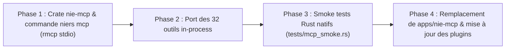

# Architecture & Spécification : Serveur MCP Rust Natif (`nie-mcp` via `rmcp`)

> **Objectif :** Établir le serveur Model Context Protocol pur Rust (`crates/tools/nie-mcp` et commande `niers mcp`), remplaçant à terme la couche intermédiaire TypeScript/Bun (`apps/nie-mcp`) en exposant in-process 100% de la surface fonctionnelle de `nie-cli` et des crates du monorepo.

---

## 1. Contexte & Enseignements de l'Implémentation Aphrody (`google_mcp`)

L'architecture du serveur frère `aphrody-mcp` dans `aphrody/crates/google_mcp` a éprouvé en conditions réelles les mécanismes idéaux d'un serveur MCP natif en Rust :

1. **Adoption de `rmcp` (Rust SDK officiel) :**
   - Épinglé sur `https://github.com/modelcontextprotocol/rust-sdk.git` (commit validé `cc66e3091e1584f48ee1e0058a2a1201a1d35c81`).
   - Fonctionnalités requises : `features = ["server", "transport-io", "macros", "schemars"]`.
2. **Routage Typé et Déclaratif :**
   - Utilisation de la macro `#[tool_router(server_handler)]` sur la structure de service.
   - Outils déclarés via `#[tool(description = "...")]` acceptant des paramètres validés à la compilation via `Parameters<T>` et sérialisés avec `schemars::JsonSchema`.
3. **Performance & Temps de Démarrage :**
   - Démarrage instantané sur stdio via `Server.serve(stdio()).await`.
   - Zéro empreinte V8/Bun, zéro risque de désynchronisation de bibliothèque partagée (`ERR_DLOPEN_FAILED`).

---

## 2. Invariants & Avantages Stratégiques pour `niers`

La migration vers un serveur MCP Rust natif procure des bénéfices décisifs :
- **Accès in-process direct au moteur :** Les crates Rust du workspace (`nie-formats`, `nie-data`, `nie-core`, `nie-lua`, `nie-trace`) sont appelées directement en mémoire, évitant toute sérialisation FFI ou passage de gros tampons binaires (textures G4TX, modèles G4MD/GLB) à travers un sous-processus.
- **Portabilité absolue :** Un binaire unique compilé (`niers.exe mcp` ou `nie-mcp.exe`) autonome, ne nécessitant ni runtime Bun, ni dépendances `node_modules`, ni Zod.
- **Cohérence des types :** Synchronisation directe avec les structs de données canoniques de `nie-data` et `nie-formats`.

---

## 3. Matrice Complète des Outils MCP (Couverture Intégrale de `nie-cli`)

Le serveur MCP natif couvre la totalité des 38 sous-commandes de `nie-cli` réparties en 32 outils MCP :

### 3.1 VFS & Extraction de Données CPK
| Outil MCP | Sous-commande `nie-cli` | Rôle & Fonctionnement |
| :--- | :--- | :--- |
| `vfs_list` | `niers vfs tree` | Navigation arborescente paginée sous un préfixe de dossier CPK. |
| `vfs_search` | `niers vfs search` | Recherche de fichiers par sous-chaîne ou motif glob (`**/*.g4md`). |
| `vfs_stat` | `niers vfs stat` | Inspection des conteneurs CPK, type d'extension et taille d'un fichier. |
| `vfs_read_bytes` | `niers vfs cat / hex` | Extraction directe et décompression des octets d'un asset VFS. |
| `vfs_extract` | `niers vfs extract` | Extraction de masse ou ciblée d'arborescences de CPK sur disque. |

### 3.2 Formats Binaires & Décodage
| Outil MCP | Sous-commande `nie-cli` | Rôle & Fonctionnement |
| :--- | :--- | :--- |
| `format_detect` | `niers format` | Détection non-destructive du format Level-5 (G4TX, CFGBIN, RDBN, T2B...). |
| `format_decode` | `niers decode` | Décodage universel d'un fichier vers JSON typé (données) ou PNG (textures). |
| `format_convert` | `niers convert` | Conversion multiformat (PNG, WEBP, GLB, SVG) d'assets disque ou VFS. |
| `refresh_typed_json` | `niers refresh-typed-json` | Régénération des formats iecode typés à côté des fichiers `*.cfg.bin`. |

### 3.3 Reverse Engineering, Base de Connaissance & Mémoire Live
| Outil MCP | Sous-commande `nie-cli` | Rôle & Fonctionnement |
| :--- | :--- | :--- |
| `re_coverage` | `niers coverage` | Rapport de couverture de classification des 117 068 fonctions du binaire. |
| `re_function` | `niers disasm / pdata` | Détail d'une fonction, métadonnées, pagerank, adresse virtuelle et xrefs. |
| `re_query` | `niers wiki / query` | Requête SQL SELECT sécurisée en lecture seule sur `var/niers.sqlite`. |
| `re_strings` | `niers strings` | Extraction et recherche de chaînes ASCII/UTF-16 du binaire `nie.exe`. |
| `re_rtti` | `niers rtti` | Exploration des classes C++ MSVC RTTI et de leurs hiérarchies. |
| `re_disasm_slice` | `niers disasm` | Désassemblage dynamique via iced-x86 d'une tranche d'octets de `.text`. |
| `mem_status` | `niers mem` | Détection du processus live `nie.exe` et lecture des régions mémoire. |
| `mem_read` | `niers mem dump` | Lecture sécurisée d'une plage d'adresses en mémoire vive. |

### 3.4 Environnement Lua 5.2
| Outil MCP | Sous-commande `nie-cli` | Rôle & Fonctionnement |
| :--- | :--- | :--- |
| `lua_inspect` | `niers lua` | Analyse statique d'un script Lua (fonctions déclarées, chaînes, CRC32). |
| `lua_run` | `niers lua-run` | Exécution d'un chunk `.lua.bin` sous VM Lua 5.2 sandboxée avec includes VFS. |
| `lua_audit` | `niers lua-audit` | Mesure de compatibilité en lot des scripts du jeu contre les stubs du moteur. |

### 3.5 3D, Interface Utilisateur & Multimédia
| Outil MCP | Sous-commande `nie-cli` | Rôle & Fonctionnement |
| :--- | :--- | :--- |
| `asset_get` | Interne / ModelServe | Décodage à la volée de modèles 3D (.glb), textures (PNG) ou audio (WAV). |
| `ui_icons_search` | `niers icons` | Index et résolution de découpe des icônes et sprites d'atlas. |
| `avatar_inspect` | `niers avatar` | Recettes, catalogue et pièces de l'éditeur de personnage (`chara_edit`). |
| `render_glb` | `niers render` | Rendu hors-écran d'un modèle GLB en image PNG ou turntable GIF (`nie-render3d`). |
| `video_manifest` | `niers video` | Inventaire et métadonnées des vidéos Sofdec2/USM du jeu. |

### 3.6 Diagnostic, Sauvegardes & Modding
| Outil MCP | Sous-commande `nie-cli` | Rôle & Fonctionnement |
| :--- | :--- | :--- |
| `game_info` | `niers info` | Empreinte sha256 du binaire, état EAC, volume VFS et composants Steam. |
| `game_launch` | `apps/nie-mcp` | Lancement détaché de `nie.exe` avec capture du PID. |
| `save_inspect` | `niers save` | Déchiffrement et inspection d'une sauvegarde Lives IEVR. |
| `mod_validate` | `niers mod / viola` | Contrôle de validité d'une archive CPK modifiée ou d'un mod. |

### 3.7 Pont Explorateur & Fichiers du Dépôt
| Outil MCP | Rôle & Fonctionnement |
| :--- | :--- |
| `explorer_status` | État du pont de communication WebSocket vers `nie-explorer`. |
| `explorer_navigate` | Navigation assistée dans l'arborescence VFS de l'explorateur. |
| `explorer_open` | Ouverture automatique d'un asset sélectionné dans l'UI. |
| `explorer_tab` | Sélection programmée de l'onglet actif. |
| `repo_read` | Lecture sécurisée des sources et de la documentation du monorepo. |

---

## 4. Feuille de Route d'Implémentation & Jalons



1. **Jalon 1 — Déclaration de la crate & squelette `rmcp` :**
   - Ajout de la dépendance `rmcp` dans le workspace Cargo.
   - Création de `crates/tools/nie-mcp` exposant le serveur stdio.
   - Intégration de la sous-commande `niers mcp` dans `crates/tools/nie-cli`.
2. **Jalon 2 — Connexion directe des domaines métier :**
   - Câblage direct de `nie-formats`, `nie-data`, `nie-lua`, `nie-trace` sans FFI.
3. **Jalon 3 — Certification & Parité des Tests :**
   - Implémentation du smoke test d'intégration validant les 32 outils en un temps de cycle record (< 500 ms).
4. **Jalon 4 — Bascule Finale :**
   - Mise à jour de `.mcp.json` pour invoquer `target/release/niers.exe mcp`.
   - Archivage de la couche Bun `apps/nie-mcp`.

## 5.1 API native Computer Use ciblée

Le crate `nie-computer-use` porte la frontière locale vers `nie.exe` et Ghidra.
Il expose la commande read-only :

```text
niers computer-use nie-exe --executable <path>
niers computer-use ghidra --ghidra-url http://127.0.0.1:8080/mcp
```

La réponse suit `schemas/computer-use-probe.schema.json`. `available: true` signifie que la
cible est trouvée ou que l'endpoint HTTP est joignable ; cela ne signifie ni que le jeu est lancé,
ni qu'un handshake MCP Ghidra est terminé. Les actions visibles restent dans la frontière
WinClean/Computer Use, avec observation avant et après et validation humaine.

La crate réexporte aussi l'intégralité des surfaces publiques sous `nie_computer_use::re` et
`nie_computer_use::trace`. `NiersComputerUse` fournit la façade ciblée `nie.exe` pour trouver le
PID, résoudre les modules/plages et lire exactement une plage mémoire. Les opérations d'écriture
de `nie-trace` restent hors de cette façade read-only.

La façade expose également `snapshot`, `scan_aob` et `catalog_entry`. Le scan est limité par
`limit` et par les régions du module demandé. Les capacités d'écriture, de dump disque, de
lancement, de recette effective et de patch EAC ne sont pas implicitement activées : elles
nécessitent une commande distincte, une autorisation explicite et une preuve post-opération.

La décision détaillée et la matrice complète des API sont dans
[`COMPUTER-USE-RE-TRACE.md`](COMPUTER-USE-RE-TRACE.md).

Références vérifiées : [MCP Tools](https://modelcontextprotocol.io/specification/2025-06-18/server/tools),
[MCP Schema](https://modelcontextprotocol.io/specification/2025-11-25/schema),
[GhidraMCP](https://github.com/gnummers/ghidra-mcp), et [OpenAI Computer Use](https://developers.openai.com/api/docs/guides/tools/computer-use).

## 5. Workflow natif multi-surface

Le serveur MCP `niers` est le point d'orchestration. Il ne remplace pas les surfaces spécialisées :

| Surface | Rôle | Preuve minimale |
|---|---|---|
| Aphrody | OCR, agent, données et MCP du dépôt `aphrody` | test ciblé ou réponse MCP réelle |
| WinClean | observation/contrôle Windows et suivi PID | observation avant/après |
| niers | VFS, formats, rendu, mémoire et orchestration | commande + artefact inspecté |
| Ghidra | décompilation, xrefs, RTTI et analyse de `nie.exe` | CodeBrowser ou MCP live + export |
| Computer Use | pilotage visible de l'interface | état observé après chaque action |

Un run non trivial conserve ses entrées et preuves dans `var/runs/<run-id>/` :

```text
pending/  results/  logs/  evidence/  manifest.json
```

Le manifest contient `run_id`, `requested_scope`, `inputs`, `actions`, `outputs`, `status` et les
hashes des artefacts. Les secrets, dumps privés et assets lourds restent hors dépôt.

Niveaux de preuve : P0 (configuration), P1 (exécution locale), P2 (artefact inspecté), P3 (surface
live), P4 (run reproductible). Un déploiement ou une affirmation runtime exige P3 ; une livraison
reproductible exige P4.

Routage : données et formats passent d'abord par `niers`; l'OCR et les agents spécialisés passent
par Aphrody; une application Windows est observée par WinClean/Computer Use avant et après action;
le RE passe par Ghidra puis est normalisé dans `nie-re`/`nie-index`. Aucun résultat d'outil ne vaut
preuve tant que son artefact n'est pas inspecté. Les routes de lecture arbitraire du dépôt restent
désactivées ou authentifiées.
